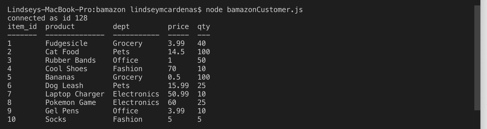
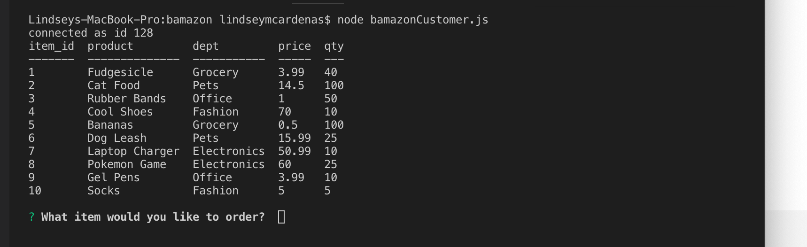
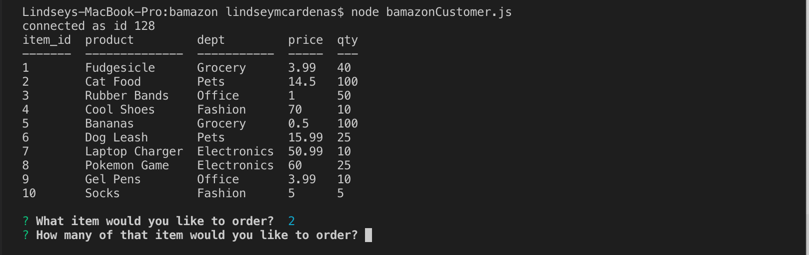
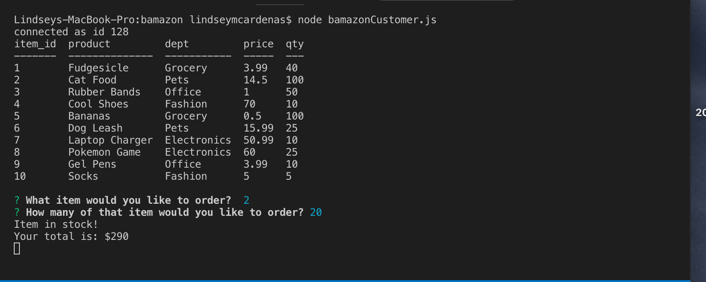

# Bamazon

## Overview

Bamazon is a Node application that will take in orders from customers and deplete stock from the store's inventory

## Installation

Use the npm package manager to install fs, mySQL, inquirer, and cTable.

```bash
npm install fs
npm install mySQL
npm install inquirer
npm install cTable
```

## How to Use

### Customer View 

1. In terminal, run ``` node bamazonCustomer.js ``` to start Bamazon which will display a table of Bamazon's inventory with the ids, names, and prices of products for sale.



2. After the table is displayed, the customer is asked to name the id of the product that they're interested in.



3. Next, the customer is asked the quantity of what they would like to order



4. Once the customer has placed the order, the application checks if Bamazon has enough of the product to meet the customer's request. 

   * If Bamazon does have enough of the product in the stock, the customer's order is fulfilled and the customer is shown the total cost of their purchase.



   * If not, the message `Insufficient quantity! Please choose a lower quantity` will display, and the is the order is prevented from going through.


5. To close the application, enter ctrl + C. 

6. To place another order or to see updates in inventory, run Bamazon again by repeating step 1

- - -
